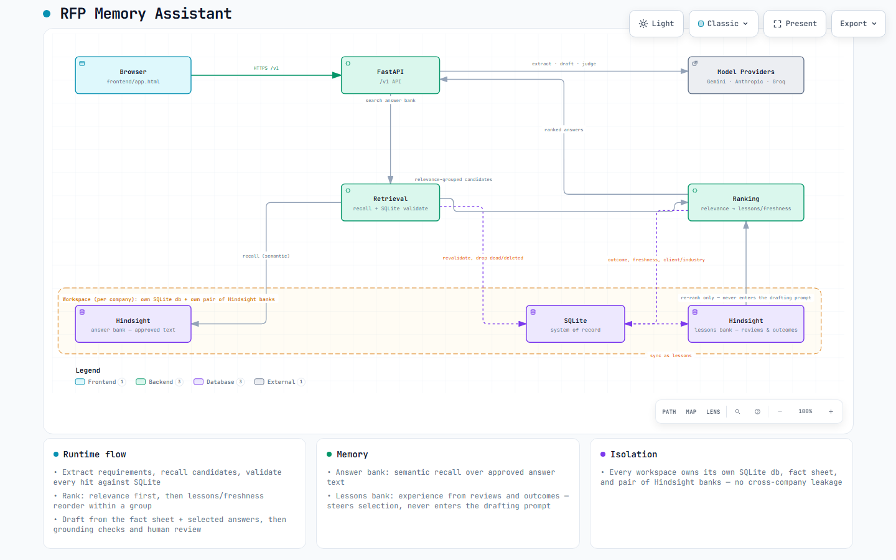

# RFP Memory Assistant

RFP Memory Assistant turns buyer RFPs and questionnaires into grounded, reviewable proposal drafts. It combines official company facts, approved past answers, and outcome-aware memory while refusing to invent unsupported commitments.

## What it does

- Extracts response requirements from PDF, Word, Excel, text, and Markdown files.
- Drafts each answer from traceable `FACT-*` and `ANS-*` evidence.
- Escalates pricing, references, staffing, and other unsupported commitments to a company expert.
- Lets reviewers accept, edit, rewrite, regenerate, or reject every answer.
- Learns from review feedback, proposal outcomes, and debriefs through Hindsight.
- Compares drafts with and without learned lessons and supports blind AI and human judging.
- Exports approved responses to Word or Excel.
- Isolates each company in its own workspace, database, uploads directory, fact sheet, and Hindsight banks.

## Architecture



SQLite is the source of truth. Hindsight holds two banks per workspace: an answer bank for semantic recall over approved answer text, and a lessons bank built from review and outcome experience. Every answer Hindsight recalls is re-checked against SQLite before drafting, and lessons only ever re-rank which approved answers get used — they never enter the drafting prompt.

Open [docs/architecture.html](docs/architecture.html) for the interactive version (pan/zoom, theme toggle, relationship tracing). See [Architecture](docs/ARCHITECTURE.md) and [How Hindsight is used](docs/HOW_HINDSIGHT_IS_USED.md) for the full write-up.

## Requirements

- Python 3.10 or newer (3.12 recommended)
- One supported model API key
- Hindsight Cloud credentials, or a local Hindsight server

## Setup

```powershell
python -m venv .venv
.\.venv\Scripts\Activate.ps1
python -m pip install -r requirements.txt
Copy-Item .env.example .env
```

Add at least one model key to `.env`:

```dotenv
GEMINI_API_KEY=your-key
# or ANTHROPIC_API_KEY=your-key
# or GROQ_API_KEY=your-key

RFP_HINDSIGHT_URL=https://api.hindsight.vectorize.io
RFP_HINDSIGHT_API_KEY=your-hindsight-key
```

The application re-reads model keys between requests. Restart it after changing Hindsight configuration.

## Run

From this directory:

```powershell
powershell -ExecutionPolicy Bypass -File .\run.ps1
```

Or start it manually:

```powershell
.\.venv\Scripts\python.exe -m uvicorn rfp_assistant.main:app --app-dir src --host 127.0.0.1 --port 8001
```

Open <http://127.0.0.1:8001>.

## Demo workflow

1. Open the workspace switcher and create a demo workspace, or create a company workspace.
2. On **Company**, add the official facts that proposal answers may cite.
3. On **Library**, import won and lost past proposals and confirm the extracted question-answer pairs.
4. On **Projects**, upload a new RFP and review its extracted requirements.
5. Draft the answers and inspect their evidence, warnings, and company-input requests.
6. Review every answer, export the completed response, and record the outcome.
7. Open **Memory** to show the resulting lessons and playbook.

For the prepared Virtusa hackathon story, follow [Demo guide](docs/DEMO.md).

## Tests

All automated tests use fake model and Hindsight clients, so they consume no provider tokens:

```powershell
.\.venv\Scripts\python.exe -m pytest -q
```

## Repository layout

```text
src/rfp_assistant/
  main.py              FastAPI entry point, workspaces, model selection
  config.py            Settings, environment, and repo-root resolution
  errors.py            shared errors and fact-sheet loading
  schemas.py           request/response and domain DTOs
  grounding.py         citation and evidence rules
  workspaces.py        per-company workspace registry
  parsing/             PDF, Word, Excel, text, and Markdown parsing
  providers/           Anthropic, Gemini, and Groq adapters, prompts, model choice
  api/v1/               routes, projects, library, memory, learning, judging, export
frontend/
  app.html              production single-page application
samples/
  corpus_v2/            fictional demo workspace seed and RFPs
  virtusa_demo/         prepared Virtusa hackathon documents
tests/                  offline unit and integration tests
docs/                   architecture, memory, and demo documentation
data/
  fact_sheet.json       bundled fictional sample facts
pyproject.toml           project metadata and pytest configuration
```

## Data and security

- `.env`, virtual environments, runtime databases, uploads, workspace registries, and model selections are Git-ignored.
- Use fictional or non-confidential documents with free model tiers and cloud services.
- The application adds no-cache and browser security headers to API responses.
- Every response requires human review before export.
