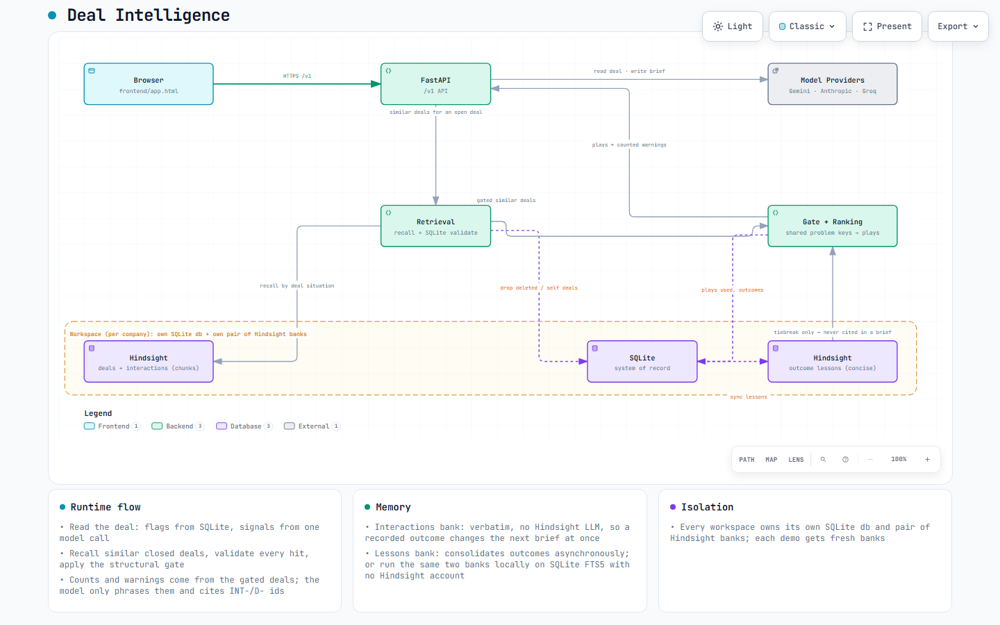

# Deal Intelligence

Deal Intelligence writes a pre-call brief for an account executive. Before a call or a forecast review, the executive normally has to reconstruct a deal's history from emails, call notes and CRM entries, and has no easy way to ask what happened in the similar deals the team already won and lost. This tool reads the deal's own notes, recalls the closed deals that resemble it, and writes a short brief in which every claim cites its source.

Hindsight remembers this deal and every past deal; one recorded outcome changes the next brief, and every changed sentence cites the deals that caused it. Memory also says what to steer away from: a play that several similar deals used and none of them won is shown as "likely to backfire", with the counts.

The project is built for Hindsight, but it also runs with no Hindsight account: a free local memory (SQLite full-text search on your machine) is used automatically when no Hindsight key is set. See [Memory backend](#memory-backend).

## Evaluation

[evaluation/](evaluation/README.md) measures whether the memory improves the recommendations, on synthetic deals with planted rules and with no model grading another. The generated report with charts is [evaluation/results/REPORT.md](evaluation/results/REPORT.md).

## What it does

- Keeps each deal's emails and call notes (upload `.txt`, `.md`, `.eml`, `.csv`, `.pdf`, `.docx`, `.xlsx`, or paste notes through the API) and reads objections, competitors, promises and stakeholders from them with one model call.
- Computes deterministic deal flags without a model: no champion, unengaged blocker, no economic buyer, overdue promise, open objection, stale deal, active competitor.
- Writes a brief with one model call. This-deal claims cite `INT-` interaction ids; claims about past deals cite `D-` closed-deal ids. Anything the model cites that was not offered to it is rejected in code.
- Recalls similar closed deals from memory, re-checks every hit against SQLite, and applies a structural gate before any deal or play counts. Warnings are honest base rates, for example "2 of 3 similar closed deals were lost (1 won despite it)".
- Recommends plays used in similar won deals that this deal has not tried, ranked first by whether the play is meant to resolve an objection this deal still has open.
- Flags plays that are likely to backfire: a play used in at least 3 similar closed deals and in none of the similar won ones, shown with its counts ("Discount offer: used in 4 similar deals, 0 won."). It is removed from the recommended plays, given to the brief prompt as a play not to recommend, and enforced in code: a next step that names it is dropped and flagged `avoided_play`.
- Records an outcome (won or lost, a loss reason, the plays actually used) and turns it into lessons in a second bank.
- Shows what changed because of memory: two briefs of the same deal are compared deterministically from their saved evidence, with no model call, including plays that newly became (or stopped being) "likely to backfire".
- Compares three arms on one deal: no history, every closed deal pasted into the prompt, and memory. The comparison also names any arm that recommended a play memory says to avoid.
- Shows the lessons bank's Reflect text about deals like the open one on the **Memory evidence** tab. It is cached, so reading it is free; refreshing asks the memory again (this spends Hindsight credits on Hindsight Cloud and is free on the local backend).
- Checks itself: the **Memory** page leaves each closed deal out in turn, rebuilds the recommendations from the others using only SQLite (no model, no Hindsight), and reports how often they pointed the right way, as counts on a small sample.
- Keeps each workspace in its own SQLite database, uploads folder and memory (a pair of Hindsight banks, or one local `memory.db`). A demo workspace seeds a fictional company with zero model calls.

## Architecture



SQLite is the system of record. The memory layer holds two banks per workspace: an interactions bank (verbatim, no Hindsight LLM) with one summary per closed deal and the notes of open deals, and a lessons bank built from recorded outcomes. On Hindsight these are two Hindsight banks; on the local backend they are two full-text tables in one SQLite file. Every deal the memory recalls is re-checked against SQLite, a structural gate decides which recalled deals count as similar, and lessons only break ties between plays; they are never cited and never enter the drafting prompt. The diagram shows the Hindsight path.

See [Architecture](docs/ARCHITECTURE.md), [How Hindsight is used](docs/HOW_HINDSIGHT_IS_USED.md), the [API contract](docs/API.md) and the [Demo guide](docs/DEMO.md).

## Requirements

- Python 3.11 or newer
- One supported model API key (Gemini free tier, Anthropic, or Groq free tier). Seeding the demo and browsing it make no model call, so even with no key you can look around; reading a deal and writing a brief need one.
- Optional: Hindsight Cloud credentials, or a local Hindsight server (default `http://127.0.0.1:8888`, no key). Without them the app uses its free local memory.

## Setup

```powershell
python -m venv .venv
.\.venv\Scripts\Activate.ps1
python -m pip install -r requirements.txt
Copy-Item .env.example .env
```

Fill in exactly one model key in `.env`. Add the Hindsight key only if you have a Hindsight account:

```dotenv
GEMINI_API_KEY=your-key
# or ANTHROPIC_API_KEY=your-key
# or GROQ_API_KEY=your-key

# Optional, for Hindsight Cloud. Leave the key empty to use the free local memory instead.
DEAL_HINDSIGHT_URL=https://api.hindsight.vectorize.io
DEAL_HINDSIGHT_API_KEY=your-hindsight-key
```

With `DEAL_LLM_PROVIDER=auto` (the default) the provider is the first key found, in the order Anthropic, Gemini, Groq. The application re-reads `.env` between requests, so a model key saved there takes effect without a restart. Restart after changing Hindsight or memory-backend settings.

### Memory backend

`DEAL_MEMORY_BACKEND` chooses where the two banks live:

| Value | Behaviour |
|---|---|
| `auto` (default) | Local memory when there is no Hindsight API key and the URL is Hindsight Cloud. Otherwise Hindsight. A local Hindsight server URL (for example `http://127.0.0.1:8888`) stays Hindsight. |
| `hindsight` | Always Hindsight (Cloud with a key, or a local server). |
| `local` | Always the local SQLite memory, whatever else is set. |

The local backend keeps both banks in `memory.db`, beside the workspace's database, using SQLite FTS5. What that changes:

- Recall is keyword search ranked by bm25, not Hindsight's semantic search. It is weaker: a deal described in different words may rank lower. The structural gate and the counts do most of the work either way, and every recalled deal is still re-checked against SQLite.
- It runs offline, needs no Hindsight account, costs no Hindsight credits, and sends nothing anywhere.
- The playbook and the Reflect text are computed locally and deterministically from the recorded outcomes (counts, no invented claims) and say so in a footer.
- `GET /v1/status` reports `hindsight.backend` as `local` or `hindsight`.

Hindsight remains the memory layer this project is built for; the local backend exists so the app, the tests and the demo run with just a model key.

## Run

From this directory:

```powershell
powershell -ExecutionPolicy Bypass -File .\run.ps1
```

`run.ps1` creates the virtual environment on first use and listens on port 8002. Pass `-Port 8003` to use another port. Or start it manually:

```powershell
.\.venv\Scripts\python.exe -m uvicorn deal_intelligence.main:app --app-dir src --host 127.0.0.1 --port 8002
```

Open <http://127.0.0.1:8002>.

## Demo workflow

1. Open the workspace menu, choose **New workspace...**, and press **Open the demo workspace**. Loading it makes no model calls.
2. Pricing deal first: on **Deals**, open Juniper & Vale Stores (D-024, a retail deal where the CFO asked for 15 percent off). Generate a brief in **No history** mode, then in **Hindsight memory** mode. Memory shows "Likely to backfire: Discount offer: used in 4 similar deals, 0 won." and leads with the ROI workbook and the executive sponsor call.
3. SSO deal: open Cedarline Bank and generate a brief in **Hindsight memory** mode. Read the warnings and the cited closed deals, and open the **Memory evidence** tab for the exact counts and the Reflect text.
4. Open Larkfield Credit Union, go to **Close deal / learning loop**, and record it as lost (unresolved objection, play used: Discount offer).
5. Return to Cedarline Bank and generate the Hindsight brief again. **What changed because of memory** shows the new counts and the newly recalled deal.
6. Press **Compare memory on this deal** (3 model calls) to see No history, All deals in the prompt, and Hindsight memory side by side.
7. Open **Memory** to see the journal, lessons, play statistics, closed-deal history, playbook and the self-check.

The exact on-screen numbers and timings are in the [Demo guide](docs/DEMO.md).

## Tests

All automated tests use fake model and Hindsight clients (or the local SQLite memory), so they are all offline and consume no provider tokens or Hindsight credits. The last run was 357 passed:

```powershell
.\.venv\Scripts\python.exe -m pytest -q
```

## Repository layout

```text
src/deal_intelligence/
  main.py              FastAPI entry point, workspaces, model selection, security headers
  config.py            Settings, retrieval modes, memory backend choice, environment
  workspaces.py        per-company workspace registry (database, uploads, memory)
  errors.py            shared error type
  schemas.py           structured model output (signals, brief)
  parsing/             PDF, Word, Excel, text, Markdown and email parsing
  providers/           Anthropic, Gemini and Groq adapters, error explanations, model choice
  seed/halcyon.json    synthetic demo company: 24 deals (19 closed, 5 open), 10 plays
  api/v1/
    router.py          HTTP routes
    db.py              SQLite tables and vocabulary
    deals.py           deals, uploads, notes
    signals.py         deterministic flags and the signal-extraction call
    briefs.py          brief generation and citation checking
    brief_prompts.py   the brief prompt (brief-v2)
    retrieval.py       recall, SQLite validation, gate, modes, plays to avoid
    ranking.py         the structural gate, warnings, contrast, play ranking and avoid_plays
    memory.py          interactions bank (Hindsight bank 1)
    lessons.py         lessons bank, reflect and playbook (Hindsight bank 2)
    memory_local.py    free local backend: both banks in a SQLite FTS5 file (memory.db)
    reflection.py      cached Reflect text about deals like this one
    quality.py         leave-one-out memory self-check (SQLite only)
    sync.py            outbox that keeps the memory in step with SQLite
    outcomes.py        recording a result and play credit
    experiment.py      three-arm comparison and brief diff
    demo.py            seeds the demo workspace without model calls
    jobs.py            resumable background jobs
    context.py         shared runtime context, backend choice and sync loop
    contracts.py       recommendation, avoid-play and warning data types
frontend/
  app.html             single-page application
samples/               three synthetic Tidewater Freight notes for upload
tests/                 offline unit and integration tests
docs/                  API contract, architecture, Hindsight usage, demo guide
requirements.txt       pinned dependencies
pyproject.toml         project metadata and pytest configuration
run.ps1                start script (port 8002)
.env.example           configuration template
```

## Data and security

- Every company, person, email and number in the demo is synthetic. Halcyon Software, Cedarline Bank, Larkfield Credit Union, Juniper & Vale Stores and every other named account are fictional.
- `.env`, virtual environments, runtime databases (including the local `memory.db`), uploads, the workspace registry and the saved model choice are Git-ignored.
- Use free-tier model and Hindsight keys and non-confidential documents.
- There are no CRM or email connectors in this version. Deal history comes from uploaded files and notes.
- A person closes every deal. The model cannot record an outcome or change memory.

## Honesty

- The seed is synthetic and small: 24 deals, of which 19 are closed (9 won, 10 lost) and 5 are open. Counts are small, so they are shown as counts ("2 of 3") with the number of closed deals next to them. Read them as hints, not statistics.
- At this size, pasting every closed-deal summary into the prompt also works. The comparison shows that arm side by side with memory so you can judge for yourself. Memory's claim is targeted retrieval, counted evidence with citations for every changed sentence, and scale: a team with thousands of closed deals cannot paste them all.
- A live finding, stated as it happened. On the pricing deal D-024 with a real model (Gemini), the No history arm recommended the discount play. The arm with every closed deal in the prompt and the Hindsight memory arm both avoided it. So at this size, stuffing every summary also works; memory's claim is targeted retrieval, counted evidence and citations, and scale. On the SSO deal (Cedarline) the recommended plays were identical across the three arms, and the difference was the counted warnings and the cited deals. That was one run per arm; model wording varies between runs.
- Planted noise exists on purpose so the counts are not clean. One similar deal was won despite an unresolved SSO objection, and one similar deal was lost even though a security review was done early. A win despite the pattern counts as a win, and the warning says so. The "likely to backfire" rule is strict (at least 3 similar deals and no win among them), so the discount play is flagged for the pricing deal but not for the SSO deal, where it won once.
- The memory self-check is a sanity check on a small sample, not a benchmark. On the seed (19 closed deals), computed offline from SQLite alone: for 7 of the 9 won deals there was a recommendation to check, and the top 3 recommended plays included a play really used in 5 of those 7; it warned about the unresolved objection in 6 of the 8 lost deals that had one; and it flagged a backfiring play that was really used in 4 of the 10 lost deals. One more or one fewer deal moves these a lot.
- Local recall (keyword) is weaker than Hindsight's semantic recall. The structural gate and the counts, which are computed in code, decide what counts either way.
- The wording of a brief comes from a model and varies between runs. The warning counts, similar deals, play counts, avoided plays and citation checks are computed in code and do not.
