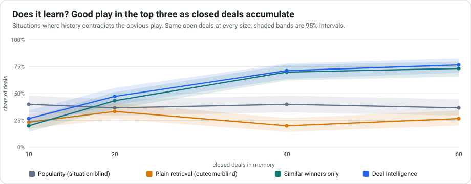
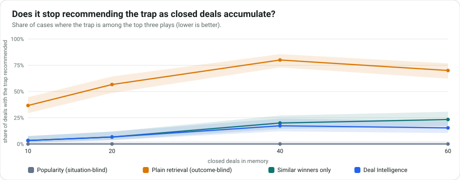
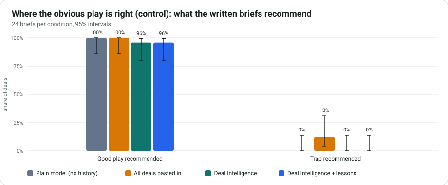
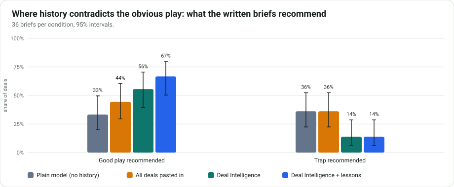
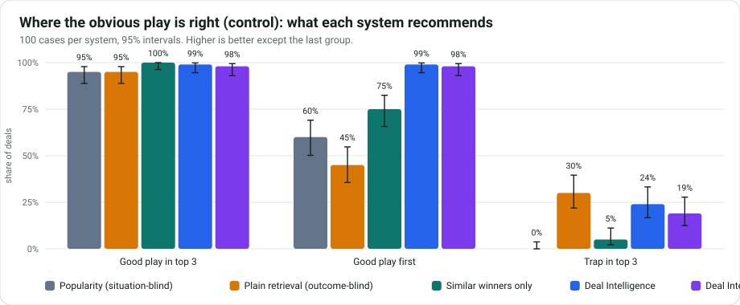
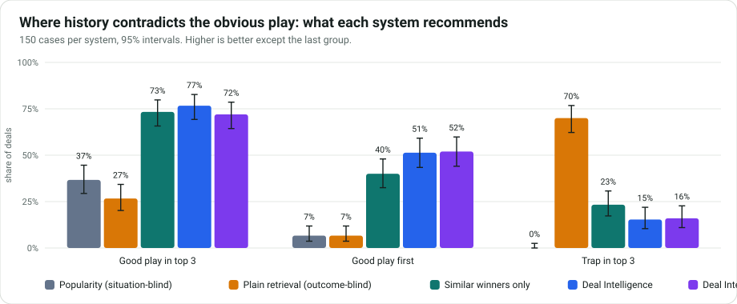

# Deal Intelligence: does the memory help, measured?

This report is generated by `python -m evaluation.report` from raw result files in this folder. It tests a mechanism on **synthetic deals with rules planted by the designer**, so it shows what the system does when history contains a pattern. It does **not** show what it would earn a real sales team.

## The claim

> When a company's own history says its obvious play loses, Deal Intelligence recommends the play that wins and warns about the one that loses. A plain model, or a plain "what did similar deals do?" lookup, cannot know that.

## The world

A fictional seller with ten sales plays. Each deal turns on one objection. Teams reach for the obvious play 45% of the time. A good play wins 88% of the time, a neutral one 50%, a trap 12%.

| Situation | Type | Obvious play | Good play | Trap |
|---|---|---|---|---|
| sso | control | PLAY-10 | PLAY-10, PLAY-01 | PLAY-02 |
| security review | control | PLAY-01 | PLAY-01 | PLAY-02 |
| pricing | counterintuitive | PLAY-05 | PLAY-03 | PLAY-05 |
| integration | counterintuitive | PLAY-06 | PLAY-04 | PLAY-06 |
| legal terms | counterintuitive | PLAY-07 | PLAY-09 | PLAY-07 |

In the three counter-intuitive situations the obvious play is the trap (company-specific, like "our legal fast-track makes buyers suspicious"). In the two control situations the obvious play is good; a system that knows nothing should do well there, and memory must not make it worse. The control traps are arbitrary rules of this world, so read the trap columns for controls with that in mind.

## Systems compared

- **Popularity**: the plays with the best win rate across all closed deals, whatever the situation.
- **Plain retrieval**: find similar deals (same objection) and recommend what they used most. Ignores whether they won.
- **Similar winners only**: the same, using only deals that won. No contrast with losses and no warnings.
- **Deal Intelligence**: the product's own retrieval, ranking and avoid list, over the local database.
- **Deal Intelligence + lessons**: the same plus lessons built from outcomes (the free local memory; no Hindsight Cloud).

## Headline

- **Retrieval (no model, 150 cases, worlds never used for design).** Where history contradicts the obvious play, Deal Intelligence puts a good play in its top three 77% of the time and the trap 15%, against 27% and 70% for a plain "what did similar deals do?" lookup, and 73% and 23% for "similar winners only".
- **Written briefs (a real model, 36 briefs per condition).** A plain model recommends a good play 33% of the time and the trap 36%. With Deal Intelligence's memory: good play 56%, trap 14%; with lessons: good play 67%, trap 14%. Pasting every past deal into the prompt (about 3x the input tokens) gave good play 44% and trap 36%.
- **No harm where the obvious play is right.** Good play recommended: Plain model (no history) 100%, Deal Intelligence 96%, Deal Intelligence + lessons 96%.
- **One ranking weakness found and fixed.** Before the fix Deal Intelligence recommended the trap in its top three 23% of the time on the held-out worlds; after, 15%.

**Read the limits before quoting any of this**: synthetic deals with rules the designer planted, small samples in the model layer (some differences are not statistically significant), one model at low thinking effort, and baselines that are deliberately simple. On the simplest outcome-aware baseline ("similar winners only") the retrieval advantage is small and not significant; the clearest gains are over outcome-blind approaches and over a plain model.

## What this evaluation found, and the one change it led to

The first run (worlds 1 to 10) showed a weakness in the product's own ranking. Plays were ordered first by whether the catalogue says they address the deal's open objection. Where this company's history contradicts the catalogue (the obvious play keeps losing), that label still put the losing play near the top, so Deal Intelligence recommended the trap more often than the simple "similar winners only" baseline. The change: the catalogue label stops boosting a play once it has been used in at least 3 similar deals and won fewer than half of them. Both numbers are plain defaults, fixed before looking at new worlds.

**On held-out worlds** (worlds not used to find or design the change; 10 worlds, same deals in both columns)

| Situation type | System | Measure | Before | After | Change | Deals only the new rule gets right / only the old | Test |
|---|---|---|---|---|---|---|---|
| counterintuitive | Deal Intelligence | good play first | 49% | 51% | +2 points (+0 to +5) | 3 / 0 | p = 0.250 |
| counterintuitive | Deal Intelligence | good play in top 3 | 77% | 77% | +0 points (+0 to +0) | 0 / 0 | p = 1.000 |
| counterintuitive | Deal Intelligence | trap in top 3 | 23% | 15% | -8 points (-13 to -4) | 12 / 0 | p < 0.001 |
| counterintuitive | Deal Intelligence + lessons | good play first | 48% | 52% | +4 points (+1 to +7) | 6 / 0 | p = 0.031 |
| counterintuitive | Deal Intelligence + lessons | good play in top 3 | 72% | 72% | +0 points (+0 to +0) | 0 / 0 | p = 1.000 |
| counterintuitive | Deal Intelligence + lessons | trap in top 3 | 22% | 16% | -6 points (-10 to -3) | 9 / 0 | p = 0.004 |
| control | Deal Intelligence | good play first | 99% | 99% | +0 points (+0 to +0) | 0 / 0 | p = 1.000 |
| control | Deal Intelligence | good play in top 3 | 99% | 99% | +0 points (+0 to +0) | 0 / 0 | p = 1.000 |
| control | Deal Intelligence | trap in top 3 | 24% | 24% | +0 points (+0 to +0) | 0 / 0 | p = 1.000 |
| control | Deal Intelligence + lessons | good play first | 98% | 98% | +0 points (+0 to +0) | 0 / 0 | p = 1.000 |
| control | Deal Intelligence + lessons | good play in top 3 | 98% | 98% | +0 points (+0 to +0) | 0 / 0 | p = 1.000 |
| control | Deal Intelligence + lessons | trap in top 3 | 18% | 19% | +1 points (+0 to +3) | 0 / 1 | p = 1.000 |

**On the development worlds** (the worlds the problem was found on; 10 worlds, same deals in both columns)

| Situation type | System | Measure | Before | After | Change | Deals only the new rule gets right / only the old | Test |
|---|---|---|---|---|---|---|---|
| counterintuitive | Deal Intelligence | good play first | 63% | 70% | +7 points (+3 to +11) | 11 / 1 | p = 0.006 |
| counterintuitive | Deal Intelligence | good play in top 3 | 93% | 95% | +1 points (-1 to +4) | 3 / 1 | p = 0.625 |
| counterintuitive | Deal Intelligence | trap in top 3 | 30% | 12% | -18 points (-24 to -12) | 27 / 0 | p < 0.001 |
| counterintuitive | Deal Intelligence + lessons | good play first | 59% | 69% | +11 points (+6 to +16) | 16 / 0 | p < 0.001 |
| counterintuitive | Deal Intelligence + lessons | good play in top 3 | 90% | 91% | +1 points (+0 to +3) | 2 / 0 | p = 0.500 |
| counterintuitive | Deal Intelligence + lessons | trap in top 3 | 29% | 9% | -21 points (-27 to -15) | 31 / 0 | p < 0.001 |
| control | Deal Intelligence | good play first | 97% | 96% | -1 points (-3 to +0) | 0 / 1 | p = 1.000 |
| control | Deal Intelligence | good play in top 3 | 97% | 97% | +0 points (+0 to +0) | 0 / 0 | p = 1.000 |
| control | Deal Intelligence | trap in top 3 | 5% | 6% | +1 points (+0 to +3) | 0 / 1 | p = 1.000 |
| control | Deal Intelligence + lessons | good play first | 100% | 97% | -3 points (-7 to +0) | 0 / 3 | p = 0.250 |
| control | Deal Intelligence + lessons | good play in top 3 | 100% | 100% | +0 points (+0 to +0) | 0 / 0 | p = 1.000 |
| control | Deal Intelligence + lessons | trap in top 3 | 4% | 4% | +0 points (+0 to +0) | 0 / 0 | p = 1.000 |

## Layer 1: retrieval and ranking (no model involved)

10 generated worlds, each with 60 closed deals in memory and 25 open deals to advise on (250 cases per system). A case is marked right when the top three recommended plays include a good play, and marked wrong on the trap when they include the trap play for that situation. Intervals are 95%.

### Where history contradicts the obvious play (n = 150 cases per system)

| System | Good play in top 3 | Good play first | Trap in top 3 | Trap flagged to avoid | Good play wrongly flagged |
|---|---|---|---|---|---|
| Popularity (situation-blind) | 37% (29% to 45%) | 7% (4% to 12%) | 0% (0% to 2%) | n/a | n/a |
| Plain retrieval (outcome-blind) | 27% (20% to 34%) | 7% (4% to 12%) | 70% (62% to 77%) | n/a | n/a |
| Similar winners only | 73% (66% to 80%) | 40% (33% to 48%) | 23% (17% to 31%) | n/a | n/a |
| Deal Intelligence | 77% (69% to 83%) | 51% (43% to 59%) | 15% (10% to 22%) | 41% (33% to 49%) | 0% (0% to 2%) |
| Deal Intelligence + lessons | 72% (64% to 79%) | 52% (44% to 60%) | 16% (11% to 23%) | 58% (50% to 66%) | 0% (0% to 2%) |

### Where the obvious play is right (control) (n = 100 cases per system)

| System | Good play in top 3 | Good play first | Trap in top 3 | Trap flagged to avoid | Good play wrongly flagged |
|---|---|---|---|---|---|
| Popularity (situation-blind) | 95% (89% to 98%) | 60% (50% to 69%) | 0% (0% to 4%) | n/a | n/a |
| Plain retrieval (outcome-blind) | 95% (89% to 98%) | 45% (36% to 55%) | 30% (22% to 40%) | n/a | n/a |
| Similar winners only | 100% (96% to 100%) | 75% (66% to 82%) | 5% (2% to 11%) | n/a | n/a |
| Deal Intelligence | 99% (95% to 100%) | 99% (95% to 100%) | 24% (17% to 33%) | 12% (7% to 20%) | 0% (0% to 4%) |
| Deal Intelligence + lessons | 98% (93% to 99%) | 98% (93% to 99%) | 19% (13% to 28%) | 20% (13% to 29%) | 0% (0% to 4%) |

### Deal Intelligence against the simple baselines, case by case

Same deals, paired. A positive difference means Deal Intelligence is better. The sign test counts only the deals where the two disagree.

| Situation type | Against | Measure | Difference | Only DI right | Only baseline right | Test |
|---|---|---|---|---|---|---|
| counterintuitive | Plain retrieval (outcome-blind) | good play in top 3 | +50 points (+41 to +59) | 80 | 5 | p < 0.001 |
| counterintuitive | Plain retrieval (outcome-blind) | trap avoided | +55 points (+44 to +65) | 95 | 13 | p < 0.001 |
| counterintuitive | Similar winners only | good play in top 3 | +3 points (-4 to +11) | 20 | 15 | p = 0.500 |
| counterintuitive | Similar winners only | trap avoided | +8 points (+1 to +15) | 23 | 11 | p = 0.058 |
| counterintuitive | Popularity (situation-blind) | good play in top 3 | +40 points (+30 to +49) | 71 | 11 | p < 0.001 |
| counterintuitive | Popularity (situation-blind) | trap avoided | -15 points (-21 to -9) | 0 | 23 | p < 0.001 |
| control | Plain retrieval (outcome-blind) | good play in top 3 | +4 points (+0 to +9) | 5 | 1 | p = 0.219 |
| control | Plain retrieval (outcome-blind) | trap avoided | +6 points (-8 to +20) | 29 | 23 | p = 0.488 |
| control | Similar winners only | good play in top 3 | -1 points (-3 to +0) | 0 | 1 | p = 1.000 |
| control | Similar winners only | trap avoided | -19 points (-29 to -10) | 4 | 23 | p < 0.001 |
| control | Popularity (situation-blind) | good play in top 3 | +4 points (+0 to +9) | 5 | 1 | p = 0.219 |
| control | Popularity (situation-blind) | trap avoided | -24 points (-33 to -16) | 0 | 24 | p < 0.001 |

### Learning curve





## Layer 2: the written briefs (a real model, one call per brief)

240 briefs from 3 generated worlds, written by `gemini-3.5-flash-lite` at temperature 0 with the same prompt in every condition; only what the model is shown about past deals differs. Marked by code against the planted rules, not by another model.

### Where history contradicts the obvious play (n = 36 briefs per condition)

| Condition | Good play recommended | Trap recommended | Clean citations | Median seconds | Input tokens / brief |
|---|---|---|---|---|---|
| Plain model (no history) | 33% (20% to 50%) | 36% (22% to 52%) | 67% (50% to 80%) | 2 | 1968 |
| All deals pasted in | 44% (30% to 60%) | 36% (22% to 52%) | 81% (65% to 90%) | 3 | 8406 |
| Deal Intelligence | 56% (40% to 70%) | 14% (6% to 29%) | 92% (78% to 97%) | 3 | 2858 |
| Deal Intelligence + lessons | 67% (50% to 80%) | 14% (6% to 29%) | 89% (75% to 96%) | 3 | 2858 |

### Where the obvious play is right (control) (n = 24 briefs per condition)

| Condition | Good play recommended | Trap recommended | Clean citations | Median seconds | Input tokens / brief |
|---|---|---|---|---|---|
| Plain model (no history) | 100% (86% to 100%) | 0% (0% to 14%) | 54% (35% to 72%) | 2 | 1741 |
| All deals pasted in | 100% (86% to 100%) | 12% (4% to 31%) | 88% (69% to 96%) | 3 | 8198 |
| Deal Intelligence | 96% (80% to 99%) | 0% (0% to 14%) | 92% (74% to 98%) | 3 | 2888 |
| Deal Intelligence + lessons | 96% (80% to 99%) | 0% (0% to 14%) | 96% (80% to 99%) | 3 | 2888 |

### Against the plain model, brief by brief

| Situation type | Condition | Measure | Difference | Only this right | Only plain model right | Test |
|---|---|---|---|---|---|---|
| counterintuitive | All deals pasted in | good play recommended | +11 points (+3 to +22) | 4 | 0 | p = 0.125 |
| counterintuitive | All deals pasted in | trap avoided | -0 points (-19 to +22) | 7 | 7 | p = 1.000 |
| counterintuitive | Deal Intelligence | good play recommended | +22 points (+3 to +42) | 12 | 4 | p = 0.077 |
| counterintuitive | Deal Intelligence | trap avoided | +22 points (+3 to +42) | 11 | 3 | p = 0.057 |
| counterintuitive | Deal Intelligence + lessons | good play recommended | +33 points (+11 to +56) | 16 | 4 | p = 0.012 |
| counterintuitive | Deal Intelligence + lessons | trap avoided | +22 points (+3 to +42) | 12 | 4 | p = 0.077 |
| control | All deals pasted in | good play recommended | +0 points (+0 to +0) | 0 | 0 | p = 1.000 |
| control | All deals pasted in | trap avoided | -12 points (-29 to -0) | 0 | 3 | p = 0.250 |
| control | Deal Intelligence | good play recommended | -4 points (-12 to +0) | 0 | 1 | p = 1.000 |
| control | Deal Intelligence | trap avoided | -0 points (-0 to -0) | 0 | 0 | p = 1.000 |
| control | Deal Intelligence + lessons | good play recommended | -4 points (-12 to +0) | 0 | 1 | p = 1.000 |
| control | Deal Intelligence + lessons | trap avoided | -0 points (-0 to -0) | 0 | 0 | p = 1.000 |

Model usage for Layer 2: 240 briefs, 956,530 input and 120,084 output tokens.

## Charts






## Limits you should know

- The data is synthetic and the rules are the designer's. A system that finds them has passed a test of mechanism, not of business value.
- Baselines are deliberately simple; a stronger retrieval system might close some of the gap.
- Intervals describe sampling noise across generated deals and worlds, not uncertainty about real sales.
- Layer 2 uses one model at temperature 0; other models would differ.
- The next step is not a bigger benchmark but a pilot on a real team's closed deals.

## Reproduce

```powershell
cd deal-intelligence
$env:PYTHONPATH = "src;."
.\.venv\Scripts\python.exe -m evaluation.retrieval_eval 10        # free, about 4 minutes
.\.venv\Scripts\python.exe -m evaluation.brief_eval --estimate    # how many model calls, no network
.\.venv\Scripts\python.exe -m evaluation.brief_eval --seeds 2     # the real run, resumes where it stopped
.\.venv\Scripts\python.exe -m evaluation.report                   # this file and the charts
```
