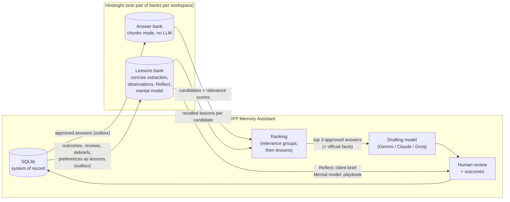

# How Hindsight is used

RFP Memory Assistant drafts answers to a buyer's RFP (request for proposal) from a company's official facts and its approved past answers, then learns from what happens next: which answers reviewers accept or reject, and which proposals are won or lost. [Hindsight](https://hindsight.vectorize.io) is the memory behind both halves. It finds the past answers worth reusing, and it remembers the experience that decides which of them to prefer.

This document covers what Hindsight stores, how each Hindsight feature is used and where in the code, the three rules that constrain it, and what we measured.

## In one picture

## Three rules

**1. Hindsight is memory, not just search.** It holds two kinds of memory. The answer bank holds *what we said*: approved answers, word for word. The lessons bank holds *what happened*: this answer was in a proposal we lost on technical fit, a reviewer rejected that one as too vague, this client prefers short answers. Retrieval uses both. Hindsight finds the relevant answers, and its lessons decide which of them to trust.

**2. SQLite remains the exact system of record.** Answer text, whether an answer is live, deleted or superseded, every review, outcome and debrief, and the audit journal live in SQLite. Hindsight holds searchable copies and learned experience. Every answer Hindsight returns is checked against SQLite before use, so a deleted or superseded answer is never offered even while its deletion is still syncing. Changes reach Hindsight through outboxes, so a Hindsight outage loses nothing.

**3. Memory can't override relevance.** Lessons change the preference among answers that are about equally relevant to the question. They can never lift an off-topic answer above a relevant one, however strong the lessons. We didn't start with this rule; we added it after a live test broke without it (see [How the design changed](#how-the-design-changed)).

A fourth, older rule still holds: **lessons never enter the drafting prompt.** They only choose which approved answers the model is shown. The model cites official facts (`FACT-…`) and approved answers (`ANS-…`) and nothing else, and every citation is checked.

## Two banks per workspace

Each workspace (a demo company, or a real company started from scratch) has its own pair of banks, so one company's memory never answers for another. The banks are created by the app on first use. The original workspace, `main`, keeps the names `rfp-library` and `rfp-lessons`.

| | Answer bank (`rfp-library-<workspace>`) | Lessons bank (`rfp-lessons-<workspace>`) |
|---|---|---|
| Holds | Every approved answer: question and answer text | Lessons: outcomes, reviews, debriefs, superseded answers, client preferences |
| Extraction | **chunks**: stored verbatim, no LLM (`retain_extraction_mode="chunks"`, observations off) | **concise**: Hindsight's LLM extracts facts; **observations** on; a retain mission and a reflect mission |
| Written by | `retain`, one per approved answer, `document_id` = the answer's ID (`ANS-0028`) | `retain_batch` with `retain_async=True`, 20 lessons per call |
| Tags | `kind:rfp_answer`, `client:…`, `industry:…` | `kind:proposal_outcome / review / debrief / project_outcome / superseded / client_preference`, `signal:positive / negative / neutral`, `answer:ANS-…`, `client:…`, `industry:…`, `action:…`, `result:…` |
| Read by | `recall` with `tags=["kind:rfp_answer"]`, `tags_match="all_strict"`: up to 12 candidates with `semantic`, `reranker` and `final` scores | `recall` with the candidates' `answer:` tags (`tags_match="any"`); `reflect`; a mental model |
| Code | `backend/v1/memory.py` | `backend/v1/lessons.py` |

## Hindsight features used, and why

| Feature | Where | What it does for the product |
|---|---|---|
| **Retain (chunks)** | `memory.py` `HindsightMemory.retain` | Makes approved answers searchable by meaning, verbatim, without spending an LLM call per answer |
| **Recall** with tags and scores | `memory.py` `recall` | Finds candidate answers for each RFP question. The `final` score decides relevance groups |
| **Retain batch, async, concise extraction** | `lessons.py` `HindsightLessons.retain`, `sync_lessons` | Turns each outcome or review into facts Hindsight can recall by meaning, e.g. "Reviewer rejected draft answer ANS-0028 … for being too vague" |
| **Tags on lessons** | `lessons.py` `_tags` | Lets retrieval ask "what do you remember about *these* candidate answers?" and lets the brief ask about *this client and industry* |
| **Recall on the lessons bank** | `retrieval.py` → `lessons.recall` | Each candidate's positive and negative lessons become its lesson factor (below) |
| **Observations** | lessons bank setting | Hindsight consolidates repeated lessons into observations that Reflect and the playbook draw on |
| **Reflect** | `api.py` `POST /v1/projects/{id}/brief` | "What we've learned about this client": a brief for the reviewer from outcomes and reviews for that client and industry. Cached per project; costs credits only when asked |
| **Mental model** | `lessons.py` `playbook` (`rfp-playbook`) | "What wins, what loses": a playbook built from every lesson. Reading is free; building or refreshing is on demand |
| **Missions** | `lessons.py` `BANK_MISSION`, `REFLECT_MISSION` | Tell Hindsight what to extract (which answers won or lost, and why) and how to advise (cite clients and answer IDs, never invent product facts) |

## Where lessons come from

A lesson is a short, plain-language record written to SQLite and then retained in the lessons bank. Each has a signal and tags.

| Event | Lesson | Signal |
|---|---|---|
| A past proposal imported with its result | One per answer in it: "Answer ANS-0023 … was submitted in the Corvid Logistics proposal in February 2025, which was lost on response quality. The answer said: …" | won: positive. Lost on technical fit or response quality: negative. Lost on price, incumbent or relationship: **neutral** (the loss says nothing about the answer) |
| A reviewer accepts, edits, rewrites or rejects a draft | One per past answer the draft cited, with the reason (too vague, outdated, incorrect…) | accepted: positive. Rejected or rewritten: negative |
| A reviewer reviews a draft that cited **no** past answer | One about the question and client, naming the answers offered but not used | as above. No answer is penalised: the reviewer didn't reject those |
| An answer is superseded as outdated | "ANS-… was marked outdated" | negative |
| A project's outcome or a section debrief is recorded | One per answer the final drafts cited | from the result or debrief score |
| A review reason that is a preference (too long, too short, too vague, tone) | "Reviewers working on RFPs for this client: …" | neutral. The preference also becomes a short drafting instruction for that client, from SQLite |

## How lessons change retrieval

For each RFP question:

1. **Candidates.** The answer bank returns up to 12 candidates with relevance scores. SQLite drops any that are deleted or superseded.
2. **Lessons.** The lessons bank is asked what it remembers about these candidates (their `answer:` tags). For each candidate, positive and negative lessons are counted, each counted once however many facts Hindsight extracted from it, with higher-ranked lessons counting slightly more. The net gives a **lesson factor** between 0.25 and 2.5 (`1 + 0.5 × net`, clamped).
3. **Relevance groups.** Candidates are grouped by Hindsight's `final` relevance score. The first group is every candidate scoring at least 1% of the best one, the next group the same over what's left, and so on. The reranker behind `final` is lopsided: a relevant but less well-matched answer can score 0.03 against 0.97 while an off-topic one scores 0.001. So a low share still separates the two.
4. **Order within a group.** `score = relevance (Hindsight's order) × lesson factor × freshness × client/industry context`. A group never overtakes an earlier one.
5. **Draft.** The top 3 approved answers are offered to the drafting model with the official facts. Lessons themselves are not.

If the lessons bank is unreachable, step 2 falls back to local signals from SQLite with a visible warning. If the answer bank is unreachable, drafting proceeds from the official facts alone, also with a warning.

## How the design changed

The first version of outcome memory (kept as the `rank` setting and labelled **V2 pre-relevance-fix**) multiplied a rank-based relevance (`1/rank`) by the lesson factor. We found the problem in a live test. A reviewer rejected the only SCIM provisioning answer, and an MFA answer took first place for a SCIM question.

We froze Hindsight's candidates and lessons for all 26 questions of two test RFPs, and scored ranking rules against an answer key without further calls (`eval/v2_relevance`). The first version had put an off-topic answer first on 3 of 22 questions **without any rejection**. An implementation answer used in three won proposals had lessons strong enough to outrank relevant answers. Relevance groups fixed it:

| 22 questions with a known right answer | Right answer first | Right answer in top 3 | Off-topic answer first | Off-topic first after one simulated rejection |
|---|---|---|---|---|
| Plain retrieval (Hindsight order, no memory) | 17 | 22 | 0 | n/a |
| Memory, pre-relevance-fix | 16 | 22 | 3 | 2 of 22 |
| **Memory, relevance groups (current)** | **19** | **22** | **0** | **0 of 21** |

The grouping threshold gives the same results anywhere from 0.5% to 2%, so the 1% default isn't tuned to one question.

## What we measured live

All on fictional data in Hindsight Cloud (details in `eval/`):

- **A rejection reaches Hindsight in seconds.** A too-vague rejection was a lesson in the bank within 5 seconds of the review. A rejected SCIM answer's lesson factor dropped from ×1.95 to ×0.99 within about 20 seconds, and that change can only come from Hindsight's recall (`eval/v4/live_learning_loop.json`).
- **Feedback changed the next draft.** After a reviewer rejected a pen-test answer as too vague, the next draft for that client changed from "an independent third party performs a penetration test at least once a year" to "Ironbridge Security, an independent CREST-accredited firm, performs a full penetration test … and we run automated external vulnerability scans every quarter". That change runs through the client preference in SQLite; the same review is also a lesson in Hindsight for the brief and the playbook.
- **Memory changes which evidence is used.** Drafting two RFPs with and without lessons (same model, prompt, facts, temperature 0), drafts with lessons cited answers from won proposals more often. For example, 12 against 7 on one RFP. That run used the pre-relevance-fix ranking.
- **It doesn't make drafts dramatically better on this data.** A blind judge model compared the with- and without-lessons drafts in both presentation orders. Of 37 questions, 31 were identical or ties, lessons won 2 and lost 3 (`eval/v4/live_judge_results.json`). The official facts already answer most of these questions, so both versions often end up the same. We claim better *choice of evidence*, not better prose.

## Cost profile

| Operation | Hindsight | Drafting model |
|---|---|---|
| Storing approved answers | chunks mode: no LLM | none |
| Storing lessons | concise extraction and observations: Hindsight credits | none |
| Finding answers and their lessons for a question | two recalls | none |
| Client brief (Reflect), playbook (mental model) | credits, only when a person asks; cached | none |
| Seeding the demo workspace (8 proposals, 45 answers) | 45 answers + 45 lessons | **none**: the questions and answers are loaded as written, not extracted |

## Limits, stated plainly

- A single rejection lowers an answer's standing but changes the first answer only when a comparable relevant answer exists. On the test data, those were identical answers reused across proposals. That's deliberate: a rejected answer from a won bid is still better than an alternative from a bid lost on technical fit.
- The drafting instruction learned from "too vague" comes from SQLite, not from Hindsight recall. Hindsight holds the lesson for the brief and the playbook.
- All data is fictional. The evaluation corpus is small (two RFPs, 37 questions), so the results show the mechanism, not a production-scale effect.
- The lessons bank relies on Hindsight's LLM extraction, so lesson facts are paraphrases. The exact record stays in SQLite.
