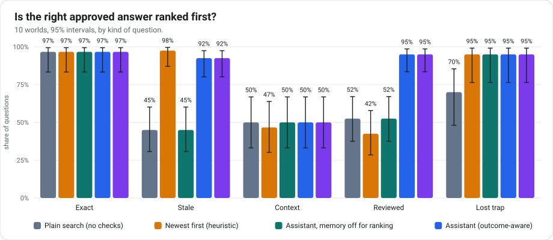
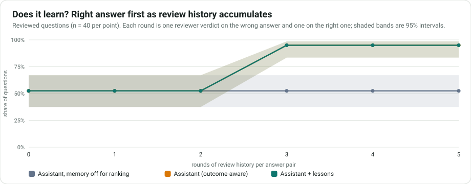

# RFP Memory Assistant: does the memory help, measured?

This report is generated by `python -m evaluation.report` from raw result files in this folder. It tests a mechanism on **synthetic questions with rules planted by the designer**, so it shows what the system does when the library and the review history contain a pattern. It does **not** show what it would earn a real proposal team.

## The claim

> When a library holds approved answers that disagree (outdated, wrong, or from a lost bid), the assistant puts the right one in front of the model, the drafted answer states the right value and cites the right evidence, memory does not make the model worse where it has nothing useful to offer, and anything nobody can answer is handed to an expert instead of invented.

## The world

A fictional software company, one fact sheet, a library of approved answers imported from eleven past proposals (one lost on technical fit), and 24 new questions per world, each drawn from 24 topics with values chosen per seed. Eight kinds of question, the right answer known by construction:

| Kind | Per world | Setup |
|---|---|---|
| Exact | 3 | one approved answer from a won proposal (control) |
| Stale | 4 | a 2021 answer with an outdated value and a 2025 answer with the current one |
| Context | 3 | two same-year answers for different industries; the right one matches the new client's industry |
| Reviewed | 4 | reviewers kept accepting one answer and kept rewriting the other because its value was wrong |
| Lost trap | 2 | a good answer from a won proposal and a wrong one from a proposal lost on technical fit |
| Conflict | 3 | an approved answer says one value, the current fact sheet says another (the fact sheet must win) |
| Fact only | 2 | only the fact sheet knows the value (control) |
| Unanswerable | 3 | nobody knows the value: the right behaviour is to hand it to an expert |

Which of two near-identical answers was imported first (and so which one a tie-breaking search returns first) is drawn per world, so ties favour no system. Review history is planted in the same shape the product's review path writes it (the same counters and the same event text that becomes a lesson).

## Systems compared

- **Plain search**: the memory's own order, no checks, no memory of outcomes (what a basic RAG does).
- **Newest first**: among answers the search scores about as high as its best, drop lost proposals and take the newest. One line of code.
- **Assistant, memory off for ranking**: the product's retrieval in `plain` mode (it still drops answers from lost proposals when drafting).
- **Assistant (outcome-aware)**: ranks by the review statistics, outcomes and freshness in its own database.
- **Assistant + lessons**: the same plus lessons built from reviews and outcomes (a local stand-in for the Hindsight lessons bank).

## Headline

- **Retrieval (no model, worlds never used for design).** Where the library holds near-duplicate answers that disagree, plain search puts the right one first 45% of the time for stale answers and 52% where reviewers had been rewriting the wrong one. The assistant's memory: 92% and 95%. A one-line "newest first" rule gets 98% on stale answers but only 42% on reviewed ones, and 47% on industry context.
- **What memory does not do here.** Industry context: right answer first 50% with memory against 50% without. The product's industry and client bonus is too small to ever overturn a search position, so it is inert in this evaluation (see Findings).
- **No harm elsewhere.** One clear answer: 97% without memory, 97% with. Answers from a proposal lost on technical fit are dropped by the product when drafting: right first 95% (search with no checks: 70%).

**Read the limits before quoting any of this**: synthetic questions with rules the designer planted, a local lexical search standing in for Hindsight's semantic search, small samples in the model layer, one model at low thinking effort, and baselines that are deliberately simple.

## What this evaluation found

**1. The industry and client bonus never changes a result.** Where the right answer is the one written for the new client's own industry, the assistant put it first 43% of the time on the development worlds (50% on the held-out worlds) with outcome memory, 43% (50%) with lessons, and 43% (50%) with memory off. Which of two same-year answers comes first is a coin flip per question, so about half is chance. Cause: inside a group of about equally relevant answers, the score is search position (1 for first, 1/2 for second) times quality, freshness and context, and context is worth at most 1.10 for a same client and 1.05 for a same industry. A bonus of 5 to 10% cannot move an answer up a place that costs 50%. Review history (quality) and age (freshness) can, which is why those two work. The design intent ("context reorders within a relevance group") is not met for answers that differ only in context. **Not changed**: a fix has to be tested against real Hindsight scores, not this evaluation's lexical stand-in (see below).

**1b. How big would the bonus have to be?** To move an answer up one place a bonus must exceed (r+1)/r for the answer at position r: x2.00 for 2nd to 1st, x1.50 for 3rd to 2nd. The shipped maximum is x1.155 (same client and same industry), so it can only reorder answers at positions 7 and below, and only the top three are ever shown. Raising the industry bonus to a power on the development worlds (the product's source is untouched, the score is rescaled in a wrapper):

| Industry bonus (1.05 as shipped, raised to a power) | context | exact | stale | reviewed | lost_trap |
|---|---|---|---|---|---|
| 1.05^1 = x1.05 | 43% (27% to 61%) | 100% (89% to 100%) | 98% (87% to 100%) | 90% (77% to 96%) | 90% (70% to 97%) |
| 1.05^2 = x1.10 | 43% (27% to 61%) | 100% (89% to 100%) | 98% (87% to 100%) | 90% (77% to 96%) | 90% (70% to 97%) |
| 1.05^4 = x1.22 | 43% (27% to 61%) | 100% (89% to 100%) | 98% (87% to 100%) | 90% (77% to 96%) | 90% (70% to 97%) |
| 1.05^8 = x1.48 | 43% (27% to 61%) | 100% (89% to 100%) | 98% (87% to 100%) | 90% (77% to 96%) | 90% (70% to 97%) |
| 1.05^16 = x2.18 | 100% (89% to 100%) | 100% (89% to 100%) | 98% (87% to 100%) | 90% (77% to 96%) | 90% (70% to 97%) |

The context questions are fixed only when the bonus reaches about x2 (the industry factor alone would have to be roughly 1.05^14). Nothing else moves, but that is **not evidence it is safe**: in these worlds no off-topic answer shares the client's industry, so the harm a large bonus can do (an irrelevant answer from the client's own industry outranking the right one) is untested. A world with that case, on new seeds, is the next step.

**2. The obvious fix is dangerous, which is what the gate is for.** `order_candidates` already has an unused `within="flat"` mode that drops the search position from the score inside a group, so context could decide. Tried on the development worlds (outcome-aware, same questions):

| Kind | Right first, as shipped | Right first, "flat" inside a group |
|---|---|---|
| Exact | 100% | 10% |
| Stale | 98% | 88% |
| Context | 43% | 20% |
| Reviewed | 90% | 35% |
| Lost trap | 90% | 10% |

It lets memory promote answers that are only weakly relevant. With this evaluation's lexical scores the group of "about equally relevant" answers is wide, so the damage here may be larger than real Hindsight would show; the point is that the relevance gate and the position term are doing real work. Whether a narrower group (a higher `min_share`) plus a flat order would fix context on real data is the open question.

**3. Memory needs a pattern, not one data point.** In the learning curve the assistant does not move until a pair has three rounds of history (the wrong answer rewritten twice, the right one accepted once): one rewrite is not enough to overturn the search order. This is a property of the smoothed quality score, chosen so one reviewer's opinion cannot bury an answer.

## Layer 1: retrieval and ranking (no model involved)

10 generated worlds (worlds 101 and up were never used to design anything; worlds 1 to 10 were the development worlds), each with 16 questions whose right answer is in the library. The product's own retrieval returns the three past answers the model would be shown. A case is right when the right answer is first (or in the top three). "Wrong answer first" counts the planted wrong answer (stale, rewritten, other industry, from the lost proposal) coming first. Intervals are 95%.

### Exact: one approved answer from a won proposal (control) (n = 30 per system)

| System | Right answer first | Right answer in top 3 | Mean reciprocal rank | Wrong answer first | Wrong answer shown |
|---|---|---|---|---|---|
| Plain search (no checks) | 97% (83% to 99%) | 100% (89% to 100%) | 0.98 | n/a | n/a |
| Newest first (heuristic) | 97% (83% to 99%) | 97% (83% to 99%) | 0.97 | n/a | n/a |
| Assistant, memory off for ranking | 97% (83% to 99%) | 100% (89% to 100%) | 0.98 | n/a | n/a |
| Assistant (outcome-aware) | 97% (83% to 99%) | 100% (89% to 100%) | 0.98 | n/a | n/a |
| Assistant + lessons | 97% (83% to 99%) | 100% (89% to 100%) | 0.98 | n/a | n/a |

### Stale: a 2021 answer with an outdated value and a 2025 answer with the current one (n = 40 per system)

| System | Right answer first | Right answer in top 3 | Mean reciprocal rank | Wrong answer first | Wrong answer shown |
|---|---|---|---|---|---|
| Plain search (no checks) | 45% (31% to 60%) | 100% (91% to 100%) | 0.72 | 48% (33% to 63%) | 98% (87% to 100%) |
| Newest first (heuristic) | 98% (87% to 100%) | 98% (87% to 100%) | 0.97 | 0% (0% to 9%) | 95% (83% to 99%) |
| Assistant, memory off for ranking | 45% (31% to 60%) | 100% (91% to 100%) | 0.72 | 48% (33% to 63%) | 98% (87% to 100%) |
| Assistant (outcome-aware) | 92% (80% to 97%) | 100% (91% to 100%) | 0.96 | 0% (0% to 9%) | 68% (52% to 80%) |
| Assistant + lessons | 92% (80% to 97%) | 100% (91% to 100%) | 0.96 | 0% (0% to 9%) | 68% (52% to 80%) |

### Context: two same-year answers for different industries; the right one matches the new client's industry (n = 30 per system)

| System | Right answer first | Right answer in top 3 | Mean reciprocal rank | Wrong answer first | Wrong answer shown |
|---|---|---|---|---|---|
| Plain search (no checks) | 50% (33% to 67%) | 100% (89% to 100%) | 0.73 | 37% (22% to 54%) | 100% (89% to 100%) |
| Newest first (heuristic) | 47% (30% to 64%) | 93% (79% to 98%) | 0.69 | 37% (22% to 54%) | 93% (79% to 98%) |
| Assistant, memory off for ranking | 50% (33% to 67%) | 100% (89% to 100%) | 0.73 | 37% (22% to 54%) | 100% (89% to 100%) |
| Assistant (outcome-aware) | 50% (33% to 67%) | 100% (89% to 100%) | 0.73 | 37% (22% to 54%) | 100% (89% to 100%) |
| Assistant + lessons | 50% (33% to 67%) | 100% (89% to 100%) | 0.73 | 37% (22% to 54%) | 100% (89% to 100%) |

### Reviewed: reviewers kept accepting one answer and kept rewriting the other because its value was wrong (n = 40 per system)

| System | Right answer first | Right answer in top 3 | Mean reciprocal rank | Wrong answer first | Wrong answer shown |
|---|---|---|---|---|---|
| Plain search (no checks) | 52% (37% to 67%) | 100% (91% to 100%) | 0.76 | 42% (29% to 58%) | 100% (91% to 100%) |
| Newest first (heuristic) | 42% (29% to 58%) | 95% (83% to 99%) | 0.69 | 52% (37% to 67%) | 95% (83% to 99%) |
| Assistant, memory off for ranking | 52% (37% to 67%) | 100% (91% to 100%) | 0.76 | 42% (29% to 58%) | 100% (91% to 100%) |
| Assistant (outcome-aware) | 95% (83% to 99%) | 100% (91% to 100%) | 0.97 | 0% (0% to 9%) | 30% (18% to 45%) |
| Assistant + lessons | 95% (83% to 99%) | 100% (91% to 100%) | 0.97 | 0% (0% to 9%) | 55% (40% to 69%) |

### Lost trap: a good answer from a won proposal and a wrong one from a proposal lost on technical fit (n = 20 per system)

| System | Right answer first | Right answer in top 3 | Mean reciprocal rank | Wrong answer first | Wrong answer shown |
|---|---|---|---|---|---|
| Plain search (no checks) | 70% (48% to 85%) | 100% (84% to 100%) | 0.84 | 25% (11% to 47%) | 100% (84% to 100%) |
| Newest first (heuristic) | 95% (76% to 99%) | 100% (84% to 100%) | 0.97 | 0% (0% to 16%) | 0% (0% to 16%) |
| Assistant, memory off for ranking | 95% (76% to 99%) | 100% (84% to 100%) | 0.97 | 0% (0% to 16%) | 0% (0% to 16%) |
| Assistant (outcome-aware) | 95% (76% to 99%) | 100% (84% to 100%) | 0.97 | 0% (0% to 16%) | 0% (0% to 16%) |
| Assistant + lessons | 95% (76% to 99%) | 100% (84% to 100%) | 0.97 | 0% (0% to 16%) | 0% (0% to 16%) |



### The assistant against the simple baselines, case by case

Same questions, paired. A positive difference means the assistant is better. The sign test counts only the questions where the two disagree.

| Question kind | Assistant against | Difference in right answer first | Only assistant right | Only other right | Test |
|---|---|---|---|---|---|
| Exact | Plain search (no checks) | +0 points (+0 to +0) | 0 | 0 | p = 1.000 |
| Exact | Newest first (heuristic) | +0 points (+0 to +0) | 0 | 0 | p = 1.000 |
| Exact | Assistant, memory off for ranking | +0 points (+0 to +0) | 0 | 0 | p = 1.000 |
| Stale | Plain search (no checks) | +48 points (+32 to +62) | 19 | 0 | p < 0.001 |
| Stale | Newest first (heuristic) | -5 points (-12 to +0) | 0 | 2 | p = 0.500 |
| Stale | Assistant, memory off for ranking | +48 points (+32 to +62) | 19 | 0 | p < 0.001 |
| Context | Plain search (no checks) | +0 points (+0 to +0) | 0 | 0 | p = 1.000 |
| Context | Newest first (heuristic) | +3 points (+0 to +10) | 1 | 0 | p = 1.000 |
| Context | Assistant, memory off for ranking | +0 points (+0 to +0) | 0 | 0 | p = 1.000 |
| Reviewed | Plain search (no checks) | +42 points (+28 to +57) | 17 | 0 | p < 0.001 |
| Reviewed | Newest first (heuristic) | +52 points (+38 to +68) | 21 | 0 | p < 0.001 |
| Reviewed | Assistant, memory off for ranking | +42 points (+28 to +57) | 17 | 0 | p < 0.001 |
| Lost trap | Plain search (no checks) | +25 points (+5 to +45) | 5 | 0 | p = 0.062 |
| Lost trap | Newest first (heuristic) | +0 points (+0 to +0) | 0 | 0 | p = 1.000 |
| Lost trap | Assistant, memory off for ranking | +0 points (+0 to +0) | 0 | 0 | p = 1.000 |

### Learning curve

Rounds of review history, in order: 1: bad answer rewritten (incorrect); 2: good answer accepted; 3: bad answer rewritten (incorrect); 4: good answer accepted; 5: bad answer rejected (outdated).



## Limits you should know

- The data is synthetic and the rules are the designer's. Finding them is a test of mechanism, not of business value.
- **Search is lexical, not Hindsight's semantic recall.** It misses paraphrases that share no words and occasionally ranks an unrelated answer first (the same for every system). Real recall would score differently, so ranking effects here should be re-checked against a real Hindsight bank before being trusted.
- The lessons bank is a local stand-in; the lessons themselves are the product's own text.
- Review history is planted directly rather than produced by 20 simulated reviewers, in the shape the product writes it.
- The model layer uses one model at low thinking effort and a few worlds; some differences are not statistically significant.
- Baselines are deliberately simple. A stronger retrieval system might close some of the gap.
- Freshness uses the real clock, so very old runs drift slightly.
- The next step is a pilot on a real team's past proposals, not a bigger benchmark.

## Reproduce

```powershell
cd rfp-v0
$env:PYTHONPATH = "src;."
.\.venv\Scripts\python.exe -m evaluation.retrieval_eval --seeds 10 --first-seed 101 --out heldout.json   # free
.\.venv\Scripts\python.exe -m evaluation.draft_eval --estimate                                          # calls and cost, no network
.\.venv\Scripts\python.exe -m evaluation.draft_eval --seeds 3 --effort low                               # the real run, resumes
.\.venv\Scripts\python.exe -m evaluation.report
```
